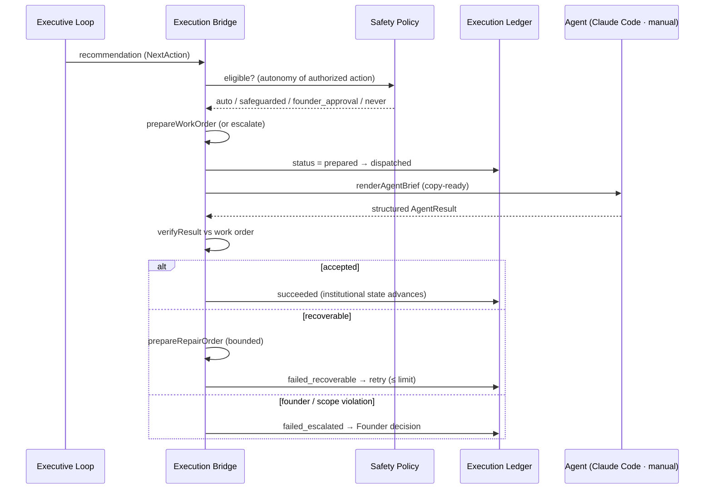
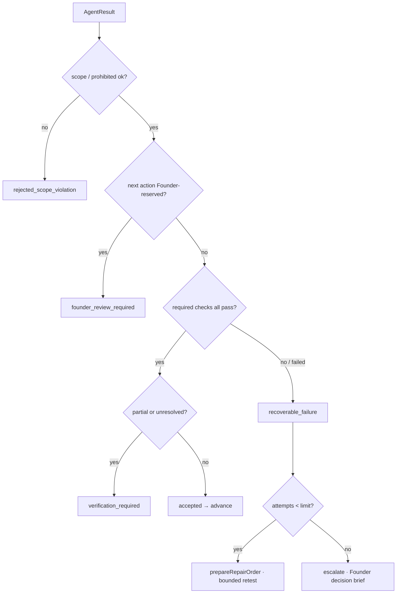

# The Autonomous Execution Bridge (AEB) — Version 1

**Status:** Implemented as a pure bridge + manual adapter + operational ledger; awaiting
Founder approval.
**Purpose:** the first safe seam between the House's institutional decision layer and an
external execution runtime — moving from *"the House knows what should happen next"* to
*"the House safely causes the next **authorized** action to happen."*

---

## 1. Architecture summary

Headquarters remains the **institutional decision authority**. An execution agent (Claude
Code or another approved runtime) is a **worker**: it accepts one bounded work order, does
the authorized work within scope, runs the required checks, and returns a **structured
result**. The worker never becomes a source of institutional truth, never redefines policy,
and never merges or deploys.

The AEB (`execution-bridge.ts`) is **pure derivation + a manual adapter**. It composes the
Institutional Executive Loop (which already produces the recommendation) and a central
**safety policy**; it does not re-decide what to do (IEL) and does not store institutional
truth (Institutional Memory). Only transient runtime status is stored — in a small,
separate **Execution Ledger** (`execution-ledger.ts`).

The lifecycle is real and testable:

> IEL recommendation → execution eligibility → typed work order → agent brief →
> **dispatch boundary** → structured result → verification → accept **or** bounded recovery
> → institutional state advances.

---

## 2. Decision → execution sequence



---

## 3. Work-order schema

```
WorkOrder {
  id                : string   // wo:${initiativeId}:${createdAt}
  initiativeId      : string   // reference to the authoritative matter
  objective         : string
  authorizedAction  : AuthorizedAction
  role              : string   // assigned executive / execution role
  scope             : { inspect: string[]; forbidModify: string[] }
  acceptanceCriteria: string[]
  requiredChecks    : string[] // tsc, npm test, build, check:prod
  stopConditions    : string[]
  escalationConditions: string[]
  mergeAuthority    : boolean  // ALWAYS false in v1
  deployAuthority   : boolean  // ALWAYS false in v1
  contextRefs       : string[]
  createdAt         : string
  status            : ExecutionStatus
}
```
Structural and machine-readable. The copy-ready brief is **rendered** from it
(`renderAgentBrief`) — prose is never the authoritative model, and an underspecified order
returns an escalation instead of a fabricated prompt.

---

## 4. Structured agent-result schema

```
AgentResult {
  workOrderId       : string
  outcome           : 'completed' | 'partial' | 'failed'
  summary           : string
  filesChanged      : string[]
  testsRun          : string[]
  verification      : { check: string; passed: boolean }[]
  unresolved        : string[]
  scopeDeviations   : string[]
  recoveryAttempts  : number
  recommendedNextAction : string
  commit?           : string
  pr?               : string
  prohibitedActionsAvoidedConfirmed : boolean
}
```
Free prose is never accepted as the result.

---

## 5. Verification & recovery flow



The verifier evaluates **evidence** — required checks, scope boundaries, prohibited-action
confirmation — never the agent's own claim of success. Recovery is bounded by
`MAX_RECOVERY_ATTEMPTS` (2); beyond it, the House escalates rather than loops.

---

## 6. Autonomy safety matrix

| Authorized action | Autonomy |
|---|---|
| `run_verification` | **auto** |
| `prepare_deliverable`, `implement_reversible`, `write_documentation` | **safeguarded** (bounded + verified; never merge/deploy) |
| spend money · change billing · change access policy · expose private data | **never** |
| destructive DB · delete production data · irreversible migration | **never** |
| change legal/privacy · merge to main · production deploy | **never** |
| institutional decision · creative decision | **never** |

One central, testable table (`SAFETY_MATRIX`); safety is never scattered across UI handlers.
Unknown actions default to **never** (safest).

---

## 7. Runtime adapter boundary

`RuntimeAdapter { id, label, unattended, dispatch(order) }` keeps runtime-specific behavior
out of the institutional engines.

- **Implemented — `manualClaudeCodeAdapter`** (`unattended: false`): renders the brief for a
  human to run in a Claude Code session and paste the structured result back.
- **Designed, not implemented** (`PLANNED_ADAPTERS`): headless Claude Code, GitHub Actions,
  scheduled cloud routine — each `unattended: true`, none claimed as working.

---

## 8. Honest Version 1 limitations

- **This is not unattended execution.** V1 implements decision automation, work-order
  preparation, agent-brief generation, a **manual** dispatch boundary, structured result
  ingestion, and institutional verification/recovery. A human still runs the session.
- **No infrastructure for autonomy exists in this repo:** there is no CI, no GitHub Actions,
  no headless runtime, and no scheduler — deployment is a manual `npm run deploy`. The AEB
  therefore ships with the manual adapter only.
- **Persistence is local-first** (`localStorage`, per browser). The ledger is not
  cross-device; unattended operation needs a shared durable store.
- Prompt generation alone is **not** autonomous execution, and is not described as such.

---

## 9. Roadmap: manual adapter → unattended overnight operation

1. **Shared durable ledger.** Move the Execution Ledger to a shared store (Cloudflare D1 or
   KV) so status survives across devices/runs. Small — the ledger shape is already minimal.
2. **Headless worker.** Introduce a headless Claude Code (or SDK) runner that consumes a work
   order, executes within scope, runs `requiredChecks`, and emits the structured result.
3. **Dispatch transport.** A queue/endpoint the House writes work orders to and the worker
   reads (never granting merge/deploy).
4. **Automated verification ingestion.** Feed the structured result back through
   `verifyResult`; advance the ledger; loop `prepareRepairOrder` up to the limit.
5. **Founder gate preserved.** Every `never`/`founder_approval` action still stops for the
   Founder — autonomy expands only across the `auto`/`safeguarded` band.
6. **Scheduling.** A nightly trigger runs the loop for eligible matters; escalations wait
   for the Founder in the morning briefing.

## 10. Recommended implementation path (given the actual environment)

There is **no CI/CD or scheduler in this repository today**, so the honest first step toward
unattended operation is to **add one runtime**, smallest-first:

1. **GitHub Actions is the lowest-lift path** — the repo is on GitHub, PRs already run
   through it, and an Action can run `npm run verify` and (later) a headless worker on a
   schedule or `workflow_dispatch`. Start with a **verification-only** Action that ingests a
   work order and runs the required checks, returning a structured result — no merge, no
   deploy.
2. **Then a headless Claude Code / Agent SDK step** inside that Action performs the
   safeguarded work within scope.
3. **Cloudflare cron/Workers** can later host the scheduler and the shared D1 ledger, since
   the site already deploys to Cloudflare Pages.

Until one of these exists, V1 remains **attended** by design — which is the safe default.
