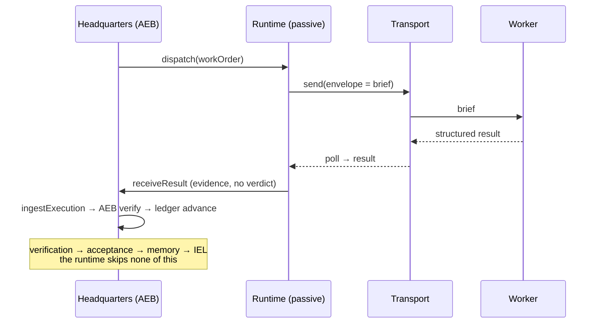

# The Execution Runtime Boundary (ERB) — Version 1

**Status:** Implemented as a transport-independent runtime contract + manual runtime + loop
discipline; awaiting Founder approval.
**Purpose:** formalize the execution runtime as a **passive** participant in the
institutional loop — it executes an authorized work order and returns structured evidence,
and nothing more.

---

## 1. Overview

The runtime is intentionally **unintelligent**. It owns no decisions, no policy, and no
institutional state. Only Headquarters observes state, derives recommendations (IEL),
verifies results (AEB), keeps operational status (Execution Ledger), and records the settled
outcome (Institutional Memory).

The runtime **never**: determines policy · derives recommendations · decides priorities ·
interprets Founder intent · modifies institutional history · bypasses verification · updates
institutional state. It introduces no engine, executive, or workflow — it formalizes a
**contract** and a **transport** boundary, and enforces **loop discipline**: every returned
execution re-enters Headquarters and none ends outside it.

---

## 2. Runtime lifecycle



`heartbeat()` and `status()` report liveness along the way; `cancel()` withdraws a work order
before completion. All are structural and form no verdict.

---

## 3. Transport abstraction

```
institutional work order → [ transport ] → runtime → structured result
```

A `Transport { id, unattended, send(envelope), poll(workOrderId) }` moves an **envelope**
(`{ workOrderId, brief }`) out and a structured result back. It carries **no institutional
knowledge** — transport details never leak into the engines. Designed transports (only
`manual` implemented in v1):

| Transport | Unattended | Implemented |
|---|---|---|
| Manual Claude Code | no | **yes** |
| Headless Claude Code | yes | no |
| GitHub Actions | yes | no |
| Cloud worker | yes | no |
| Remote runner | yes | no |

None requires an architectural change to adopt.

---

## 4. Runtime contract

```
ExecutionRuntime {
  id; label; unattended
  dispatch(order)               → Prepared<DispatchEnvelope>   // render brief → envelope
  receiveResult(result)         → AgentResult                  // pass-through; no verdict
  cancel(workOrderId)           → { workOrderId, state:'cancelled' }
  heartbeat(workOrderId, state) → { workOrderId, state, at }
  status(workOrderId, ledger?)  → { workOrderId, state }        // derives from operational status
}
RuntimeState = 'idle' | 'accepted' | 'working' | 'returned' | 'cancelled' | 'lost'
```

Structural and transport-independent — Claude Code is only one implementation
(`manualClaudeCodeRuntime`). `receiveResult` returns the evidence unchanged; the runtime
never verifies or accepts. `ingestExecution` (Headquarters-owned) routes the result through
the AEB verifier and advances the ledger, so **loop discipline** is enforced in one place.

**Recovery stays with Headquarters.** The runtime reports failure; the AEB prepares repair
work; the IEL determines what happens next. The runtime never invents recovery.

---

## 5. Future unattended execution roadmap

1. **Shared durable ledger** (D1/KV) so status survives across runs/devices.
2. **A headless runtime** implementing the same `ExecutionRuntime` contract — no engine
   change, only a new implementation.
3. **A real transport** (GitHub Actions first — see the AEB doc) implementing `send`/`poll`.
4. **Automated ingestion** loops `ingestExecution` → verify → advance → IEL, with recovery
   bounded by the AEB and escalations surfaced in the morning briefing.
5. **Founder gate preserved** — `never`/`founder_approval` actions always stop; autonomy
   expands only across the `auto`/`safeguarded` band.

---

## 6. Version 1 limitations

- **Attended only.** The single implemented runtime/transport is manual: a human carries the
  brief and returns the result. `unattended: false`.
- **No autonomy infrastructure exists** in this repo (no CI, no headless runtime, no
  scheduler), so the unattended runtimes are **designed, not implemented** — and are labelled
  as such (`TRANSPORTS[].implemented`).
- **Local-first operational state.** The ledger is per-browser; cross-device unattended
  operation needs the shared durable store above.
- The runtime formalizes the boundary; it does not, by itself, make execution autonomous.
