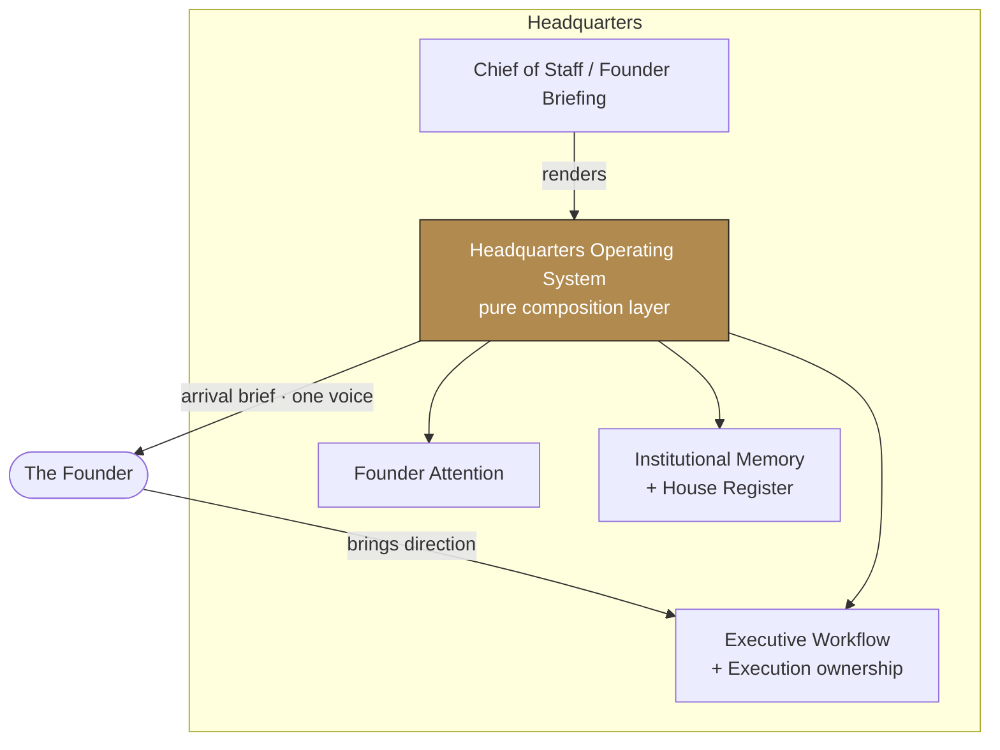
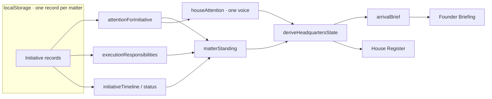
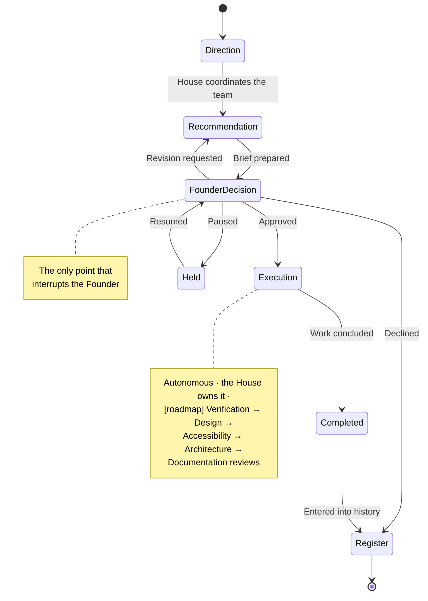

# The Headquarters Operating System (HOS) — Version 1

**Status:** Implemented as a composition layer; awaiting Founder approval.
**Purpose:** evolve the existing executive systems into one continuously-operating
institutional organization — without replacing, redesigning, or duplicating any of them.

---

## 1. Architecture summary

Headquarters already holds a complete set of authoritative systems:

- **Founder Attention** (`founder-attention.ts`) — the one model of *when the House
  should interrupt the Founder*.
- **Executive Workflow** (`executive-workflow.ts`) — initiatives, the Executive
  Brief, the Founder decision, and Execution ownership.
- **Institutional Memory + House Register** (`institutional-memory.ts`) — how the
  House remembers its work as a durable, readable record.
- **Chief of Staff / Founder Briefing** (the workspace) — the single institutional
  voice and the Founder's arrival point.

HOS (`headquarters-os.ts`) is **not** a new engine. It is a *derivation over these
derivations* — the same pattern by which the Work Queue derives from Recommendations.
It composes the systems above into one institutional picture and answers, in a single
place, the standing questions of a working organization:

> what requires attention · who owns it · what happens next · what is blocked ·
> what can proceed in parallel · what has completed · what to remember ·
> what should reach the Founder.

Because the picture is **pure derivation**, it is "continuously operating" by
construction: every state change simply changes what HOS derives, with no polling,
timers, or backend services. HOS defers to the engines it composes — attention from
Founder Attention, ownership from Execution, status and history from Institutional
Memory — and never recomputes them.

**The Founder** remains responsible only for institutional vision, creative direction,
irreversible decisions, legal/privacy concerns, and strategic approvals. HOS interrupts
her for nothing else; routine execution flows through the House autonomously.

---

## 2. Component relationship

HOS points *at* the authoritative engines (it reads them); nothing points into HOS as a
store, because it holds none. The Chief of Staff / Briefing renders the HOS picture.

---

## 3. Data & derivation flow

Facts are stored once (the Initiative). Everything the Founder sees — attention, standing,
timeline, arrival brief — is **derived** from that one record. No fact is duplicated; no
second source of truth exists.

---

## 4. Executive (matter) lifecycle

The active flow is Direction → Recommendation → Founder Decision → Execution →
Institutional Memory → House Register → Founder Briefing. The Verification, Design,
Accessibility, Architecture, and Documentation reviews are **defined but not yet active**
(`FLOW_STAGES[].active === false`) — the roadmap, never fabricated as events.

---

## 5. Roadmap toward fully autonomous executive operation

HOS v1 establishes the institutional layer and the arrival experience. The path onward,
each step composing (never replacing) the existing systems:

1. **Founder Return, deepened.** The arrival brief exists; next, one calm route from each
   arrival line directly into that matter's record.
2. **The review stages become active.** Wire Verification → Design Review → Accessibility
   Review → Architecture Review → Documentation as real post-execution stages, so a matter
   is not "completed" until it has passed the House's own standards. These are already
   named in `FLOW_STAGES`.
3. **Recovery.** Introduce a genuine failure/blocked state and an autonomous
   determine-cause → repair → verify → continue loop, escalating to the Founder only after
   recovery is exhausted. (v1 has no failure state, so `blocked` is always false.)
4. **Executive authority.** Give each executive explicit review and escalation authority so
   matters advance between executives through shared institutional state.
5. **Cross-property inheritance.** Pull Me Under, HR Baddie Society, Publishing, Creator
   Studio, and future properties adopt this operating model rather than building independent
   workflow systems — Headquarters becomes the operating system; Claude Code becomes one
   executive operating within it.

**Persistence boundary (v1):** local-first `localStorage`, per browser — not cross-device
institutional persistence. A durable store is a later, separately-approved decision.
