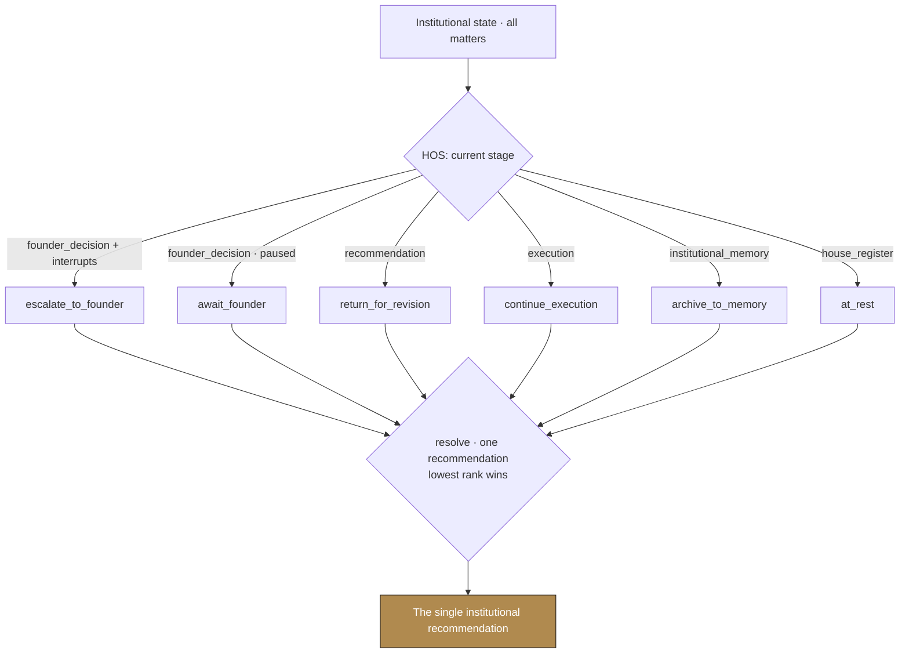
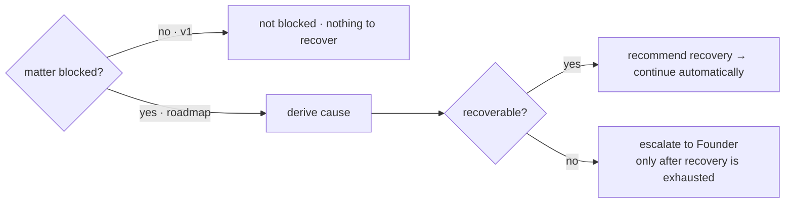

# The Institutional Executive Loop (IEL) — Version 1

**Status:** Implemented as a pure behavior layer; awaiting Founder approval.
**Purpose:** evolve Headquarters from an institutional *information* system into an
institutional *executive operating* system — by adding the behavior that continuously
determines what the House should do next.

---

## 1. Architecture summary

The Executive Loop (`executive-loop.ts`) is **not** a workflow, a data model, or another
executive. It is the institutional *behavior* that, at any moment, derives **one** thing:
what the House should do next. It **owns no state and produces recommendations only.**

It composes — and never duplicates — the Headquarters Operating System. HOS already turns
raw workflow status into an institutional picture (`currentStage`, `nextStep`,
`matterStanding`, `deriveHeadquartersState`). The Loop *classifies* that picture into a
single, typed **executive action** and resolves the whole House to exactly one
institutional recommendation. Because it is pure derivation, it is continuously operating
by construction: every state change simply changes what the Loop derives — no polling,
timers, backend, or duplicate state.

The Loop answers the standing operating questions — what work exists, who owns it, what can
continue, what waits, what can run in parallel, what needs review, what needs recovery, what
needs the Founder, and what happens next — each derivable from existing institutional state.

**The Founder** is interrupted only for creative direction, institutional policy, financial
approval, legal/privacy review, irreversible actions, or conflicting recommendations —
bound to the authoritative Founder Attention interrupt boundary. Routine implementation
never requires her coordination.

---

## 2. Executive decision flow



Priority (rank 0 wins): **escalate_to_founder** → active work (**return_for_revision /
continue_execution**, and the roadmap **assign_executive**) → reviews (**begin_review /
advance_documentation**, roadmap) → **archive_to_memory** → **await_founder** → **at_rest**.

---

## 3. Executive handoff

```mermaid
sequenceDiagram
    participant F as Founder
    participant CoS as Chief of Staff
    participant XT as Executive Team
    participant IM as Institutional Memory
    F->>CoS: brings direction
    CoS->>XT: (Loop derives) Executive Team owns execution
    Note over CoS,XT: no executive names its own successor;<br/>the Loop derives the next responsible party
    XT->>CoS: work concluded
    CoS->>F: escalate only when judgment is required
    CoS->>IM: archive concluded work into the record
```

`nextResponsible(matter)` derives who acts next from institutional state (reusing HOS
`nextStep`). Fine-grained executive-to-executive handoffs activate with the review stages
(roadmap); v1 hands between the Founder, the Executive Team, and the Chief of Staff.

---

## 4. Recovery model



`assessRecovery(matter)` establishes the institutional model without fabricating events. In
v1 there is no failure state (`matterStanding.blocked` is always false), so it reports
*not blocked*. When a genuine blocked state is introduced, the cause and recoverability are
derived here; the House continues automatically when recovery succeeds and escalates to the
Founder **only after autonomous recovery is exhausted.**

---

## 5. Roadmap toward continuous autonomous execution

1. **Surface the recommendation.** Consume `deriveExecutiveLoop().recommendation` in the
   Founder Briefing so the House's single next step is visible on arrival.
2. **Activate the review stages** (from HOS `FLOW_STAGES`): Verification → Design →
   Accessibility → Architecture → Documentation become real actions
   (`begin_review`, `advance_documentation`, `assign_executive`), and the Loop hands work
   between individual executives.
3. **Real recovery.** Introduce a blocked/failure state and the autonomous
   determine-cause → repair → verify → continue loop that `assessRecovery` already models.
4. **Executive authority.** Give each executive explicit review and escalation authority so
   the Loop advances matters through shared institutional state.
5. **Cross-property inheritance.** Pull Me Under, HR Baddie Society, Publishing, Creator
   Studio, and future properties inherit this loop rather than building independent
   workflow systems.

**Persistence boundary (v1):** unchanged — local-first `localStorage`, per browser; the Loop
adds no store of its own.
