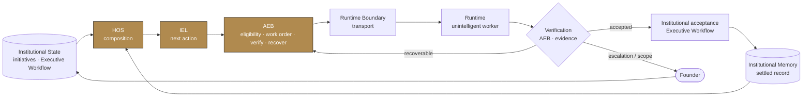
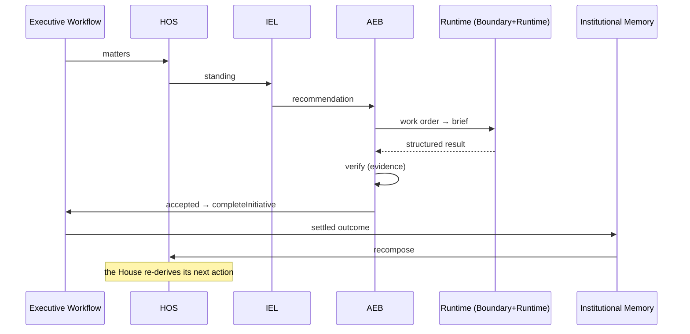

# The Institutional Loop — Headquarters canonical architecture (v1)

**Status:** Integrated and verified; awaiting Founder approval.
**Purpose:** the single authoritative reference for how every Headquarters component composes
into one continuous institutional operating loop — one state model, one loop, one ownership
model, one execution path, one verification path, one memory path.

This document supersedes any conflicting architecture description.

---

## 1. Institutional Loop architecture

Headquarters is one loop. Institutional state is a set of **initiatives** (Executive
Workflow). Everything else is **derived** from that state and returns to it. No component
reaches around another; the loop always returns to Headquarters.

`closeExecutionLoop` (institutional-loop.ts) is the thin composition that ties verification →
acceptance → memory → recomposition together. It adds no engine, state, or truth.

---

## 2. Institutional ownership matrix (exactly one owner each)

| Responsibility | Owner |
|---|---|
| Institutional state (initiatives) | Executive Workflow |
| Institutional composition | HOS |
| Next-action derivation | IEL |
| Founder interruption | Founder Attention |
| Execution eligibility | AEB |
| Work-order preparation | AEB |
| Runtime dispatch / transport | Runtime Boundary |
| Execution (do the work, return evidence) | Execution Runtime |
| Verification | AEB (`verifyResult`) |
| Recovery preparation | AEB (`prepareRepairOrder`) |
| Operational execution status | Execution Ledger |
| Institutional acceptance | Executive Workflow (`completeInitiative`) |
| Settled institutional memory | Institutional Memory |
| Loop continuation | HOS / IEL (re-derive) |

No responsibility is shared. `closeExecutionLoop` **calls** these owners; it owns none of them.

---

## 3. End-to-end lifecycle

---

## 4. State-transition audit

| Path | Advances state | Transition owner | Returns to HOS |
|---|---|---|---|
| New initiative | → brief_ready | Executive Workflow (`openInitiative`) | yes (derived) |
| Founder approval | → executing | Executive Workflow (`decide`) | yes |
| Founder revision | → revising | Executive Workflow | yes |
| Founder pause | → paused | Executive Workflow | yes |
| Founder decline | → declined (record) | Executive Workflow | yes |
| Execution success | executing → completed | **`closeExecutionLoop` → completeInitiative** | yes |
| Verification required | stays executing | AEB verify | yes |
| Recoverable failure | stays executing (+ repair order) | AEB recover | yes |
| Scope violation | stays executing (+ escalation) | AEB verify | yes (to Founder) |
| Founder escalation | awaits Founder | Founder Attention | yes |
| Completion | → completed | Executive Workflow | yes |
| Archive | completed → archived | Executive Workflow (`archiveInitiative`) | yes |

Every row returns to Headquarters.

---

## 5. Dead-end analysis

| Potential dead-end | Status |
|---|---|
| Execution finishes but never reaches memory | **Repaired.** `closeExecutionLoop` advances the initiative on acceptance → memory. |
| Memory updates but HOS never recomputes | Not possible — HOS/memory are pure derivations over the initiative; every read recomposes. |
| Verification accepted but IEL never advances | **Repaired.** Acceptance advances the initiative; IEL re-derives `archive_to_memory`. |
| Founder approval without execution | Not a dead-end — a live `executing` state awaiting the loop. |
| Runtime failure without recovery | Not possible — `closeExecutionLoop` routes failure to a bounded repair or escalation. |

No stranded states remain.

---

## 6. Recovery integration report

Recovery **always** re-enters the loop and never bypasses verification, acceptance, memory, or
HOS. A recoverable failure returns through `closeExecutionLoop`: the ledger advances to
`failed_recoverable`, the AEB prepares a **bounded** repair order, and the initiative is left
unchanged (never falsely accepted). After `MAX_RECOVERY_ATTEMPTS` the House escalates with a
Founder brief rather than looping. The runtime never invents recovery.

---

## 7. Engine responsibility matrix

| Engine | Authority | Never |
|---|---|---|
| Executive Workflow | institutional state + transitions | derives attention / next action |
| HOS | institutional composition | decides or stores truth |
| IEL | next-action recommendation | executes or verifies |
| Founder Attention | interruption boundary | performs work |
| AEB | execution authorization + verification + recovery | merges / deploys / decides institution |
| Runtime Boundary | transport | forms verdicts |
| Execution Runtime | do the work, return evidence | policy / decisions / state |
| Institutional Memory | settled record | active orchestration |

No engine has absorbed another's responsibility.

---

## 8. Remaining architectural risks

1. **Attended execution only.** The loop closes correctly, but a human still runs the worker
   (no CI/headless/scheduler exists). Autonomy is a runtime/transport addition, not a loop
   change.
2. **Local-first state.** Initiatives and the ledger live in `localStorage`; unattended,
   cross-device operation needs a shared durable store.
3. **The review stages** (Verification/Design/Accessibility/Architecture/Documentation) are
   defined in HOS but inactive — activating them is additive, within the same loop.

None are architectural regressions; each is a bounded, additive next step.

---

## 9. Honest Version 1 assessment

Headquarters now possesses:

- **one institutional state model** — the initiative (Executive Workflow);
- **one institutional operating loop** — state → HOS → IEL → AEB → Runtime → verification →
  acceptance → Memory → HOS, closed by `closeExecutionLoop`;
- **one institutional ownership model** — the matrix above, one owner per responsibility;
- **one execution path** — AEB work order → Runtime Boundary → Runtime;
- **one verification path** — AEB `verifyResult` over structured evidence;
- **one institutional memory path** — Institutional Memory, derived from the initiative.

There is **no duplicated authority, no dead end, and no competing source of truth.** The
architecture is **complete for Version 1.** What remains is not foundational architecture but
*activation* — an unattended runtime/transport and a shared durable store to run the same loop
without a human — plus the additive review stages. No further major subsystem is required.
